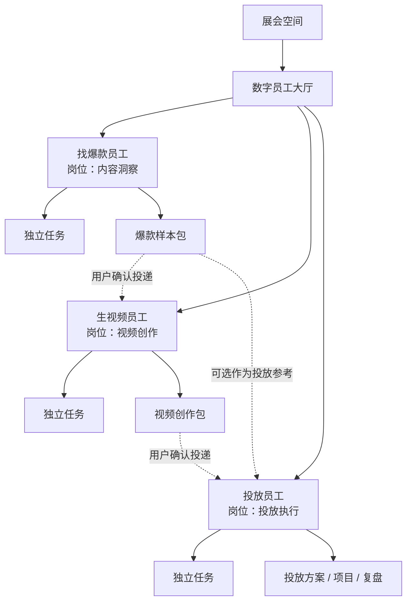
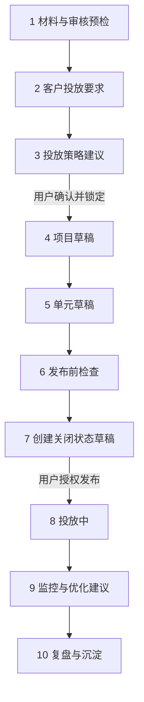
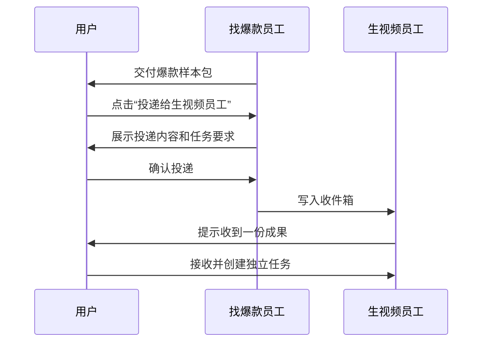
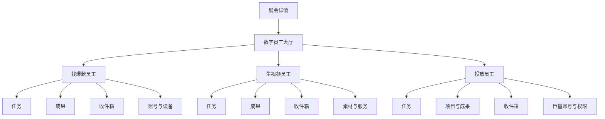

# 数字员工 V2 产品设计方案

> 适用范围：找爆款员工、生视频员工、投放员工
> 核心结论：不增加“主管员工”，三个员工保持平级、独立，通过用户确认后的成果投递协作。

---

## 1. V2 要解决的问题

当前版本把三个员工做成了一条固定流水线：

```text
找爆款 → 选样本 → 自动进入生视频 → 自动同步投放
```

这会产生四个问题：

1. 员工像流程步骤，而不像能独立工作的数字员工。
2. 用户离开后再次进入，容易恢复到第二步或第三步，无法区分“新任务”和“继续任务”。
3. 上游任务会直接影响下游页面，任务边界和成果归属不清楚。
4. 投放员工被压缩成“选择视频、填预算、创建草稿”，没有体现真实投手的判断过程。

V2 应将系统从“固定四步表单”改成：

```text
三个独立员工 + 独立任务 + 标准化成果 + 用户确认后的投递
```

---

## 2. 整体产品结构



### 三条必须遵守的规则

1. **任何员工都可以单独新建任务**，不依赖上一位员工。
2. **任何员工都不能自动跳转到下一位员工**。
3. **跨员工协作必须通过成果投递，并由用户确认**。

---

## 3. 三个员工统一使用同一套“员工外壳”

三个员工能力不同，但页面结构保持一致，降低学习成本。

```text
┌──────────────────────────────────────────────────────────────┐
│ ← 返回数字员工     生视频员工                  [设置] [新建任务] │
│ 视频创作 · 工作中 2 · 待确认 1 · 今日完成 3                   │
├──────────────────────────────────────────────────────────────┤
│ 任务  │ 成果  │ 收件箱  │ 账号与设备                          │
├──────────────────────────────────────────────────────────────┤
│                                                              │
│  运行中的任务                                                 │
│  新能源展会宣传片    生成中 68%       [查看任务]               │
│  汽配展招商视频      等待确认脚本      [去确认]                 │
│                                                              │
│  最近完成                                                     │
│  数字人展招商视频    已完成            [查看成果]               │
│                                                              │
└──────────────────────────────────────────────────────────────┘
```

## 3.1 员工首页的四个标签

### 任务

- 运行中
- 待我确认
- 排队中
- 已失败
- 最近完成
- 新建任务

### 成果

- 当前员工交付的所有成果
- 支持预览、下载、复制、创建新版本、投递给其他员工

### 收件箱

- 其他员工投递过来的成果
- 用户可以“接收并新建任务”或“暂不处理”
- 收到成果不代表自动创建或自动执行任务

### 账号与设备

- 平台账号绑定
- 本地采集器状态
- 巨量授权状态
- 素材目录和服务连接

账号绑定属于员工能力配置，**不再作为每次任务的第一步**。

---

## 4. “新建任务”和“继续任务”必须彻底分开

### 点击“新建任务”

- 永远创建新的任务 ID。
- 永远从空白表单开始。
- 不恢复上一次任务的步骤、样本或参数。
- 可以主动选择“从已有成果创建”，但必须由用户选择。

### 点击任务卡片

- 才恢复对应任务的阶段、日志、结果和确认状态。
- 离开页面不会中断后台任务。
- 再次进入时显示真实状态，而不是依赖浏览器内存推断步骤。

### 建议统一状态

```text
草稿 / 排队中 / 执行中 / 待确认 / 已完成 / 已失败 / 已取消
```

页面阶段只负责展示，服务器任务状态才是事实来源。

---

## 5. 找爆款员工设计

### 5.1 岗位定义

**名称：** 找爆款员工
**岗位：** 内容洞察
**职责：** 从指定平台检索内容，完成去重、相关性判断、互动分析和样本推荐。
**独立交付：** 爆款样本包。

### 5.2 可以接收的输入

- 平台与关键词
- 发布时间范围
- 数量和排序条件
- 账号主页或指定链接
- 用户手动导入的视频链接
- 已有客户/展会档案

### 5.3 员工内部链路


不再出现“交给生视频员工”作为第四个任务步骤。

### 5.4 页面结构

#### 新建任务

```text
检索目标
关键词：新能源产业展
平台：抖音
时间范围：半年内
目标数量：30
排序偏好：互动表现优先

设备状态
本地采集器：在线
抖音登录状态：已登录

[开始检索]
```

#### 执行页

```text
正在检索“新能源产业展”

已发现链接       86
完成去重         54
完成内容分析     31
目标样本         30

当前阶段：正在补全封面和互动信息

[返回员工首页]
```

返回后任务继续运行。

#### 结果页

每个样本显示：

- 封面、标题、作者和平台链接
- 播放/点赞/评论等可取得数据
- 内容相关性：高/中/低
- 爆款表现：高/中/低
- 可复刻程度：高/中/低
- 推荐理由
- 加入样本包

### 5.5 AI 介入点

AI负责：

- 过滤关键词碰巧命中但内容无关的结果
- 聚合同一视频或搬运内容
- 判断内容结构、开头钩子、卖点、行动引导
- 给样本分组，而不是只按点赞数排序
- 明确说明推荐依据和数据缺口

AI不负责：

- 未经用户确认自动选定唯一参考视频
- 自动启动生视频任务

### 5.6 最终成果

```text
爆款样本包
├── 选中样本
├── 样本原始链接
├── 内容标签
├── 开头钩子分析
├── 话术和镜头结构
├── 推荐理由
└── 数据快照时间
```

成果页底部提供可选动作：

```text
[投递给生视频员工] [下载报告] [复制成果链接] [基于本结果重新检索]
```

---

## 6. 生视频员工设计

### 6.1 岗位定义

**名称：** 生视频员工
**岗位：** 视频创作
**职责：** 根据业务要求、参考样本或用户素材完成创意、脚本、声音、画面、字幕和成片。
**独立交付：** 视频创作包。

### 6.2 必须支持四种独立入口

```text
新建视频任务

[从零开始创作]
[使用爆款样本包]
[粘贴参考视频链接]
[使用已有素材和文案]
```

即使完全没有找爆款员工的成果，也可以工作。

### 6.3 员工内部链路


### 6.4 交互重点

AI不要直接生成唯一脚本，先给出 2～3 个可理解的创意方向：

```text
方案 A：现场冲击型（员工推荐）
适合获取播放和互动，前三秒直接展示展会现场。

方案 B：行业趋势型
适合建立专业度，但节奏相对较慢。

方案 C：招商转化型
适合获取咨询，营销感更强。

[采用 A] [采用 B] [采用 C] [让员工重新设计]
```

用户确认创意方向后，再进入脚本和生成阶段。

### 6.5 AI 介入点

AI负责：

- 从客户目标和参考样本提炼创意方向
- 生成多个脚本方案
- 检查是否过度模仿参考视频
- 将脚本拆为分镜和素材需求
- 判断信息完整性、前三秒、节奏、CTA
- 成片后生成质量检查结果

关键节点由用户确认：

- 创意方向
- 最终口播稿
- 最终成片版本

### 6.6 最终成果

```text
视频创作包
├── 创作要求
├── 使用的参考样本
├── 创意方向
├── 最终脚本
├── 分镜表
├── 配音和字幕配置
├── 成片及历史版本
├── 标题/简介/封面建议
└── 成片质量检查
```

成果页提供：

```text
[投递给投放员工] [下载成片] [创建新版本] [复制成果链接]
```

成片完成后不再“自动同步给投放员工”。

---

## 7. 投放员工设计

### 7.1 岗位定义

**名称：** 投放员工
**岗位：** 投放执行
**职责：** 完成审核预检、客户要求采集、投放策略建议、项目与单元搭建、发布前检查、投中监控和复盘。
**工作模式：** 默认半托管。
**独立交付：** 投放方案、项目草稿、单元草稿、优化记录和复盘报告。

### 7.2 投放员工也必须可以独立开始

```text
新建投放任务

[使用视频创作包]
[从素材库选择视频]
[上传视频和落地页]
[基于历史项目复制]
```

不能要求用户必须先经过生视频员工。

### 7.3 账号授权移出任务步骤

当前“1 绑定巨量 → 2 选择视频 → 3 创建任务”需要调整。

账号授权放到员工的“账号与设备”中长期保存。新建任务时只做能力检查：

```text
巨量账户：已连接
广告主账户：杭州某某会展有限公司
素材权限：可用
项目创建权限：可用
报表权限：可用
```

如果没有连接，显示就地修复提示，但不把授权变成每个任务的业务阶段。

### 7.4 投放员工完整任务链



### 7.5 阶段一：材料与审核预检

```text
投放材料

视频素材       新能源展会宣传片 V3      审核通过
落地页         新能源展会招商页         审核中
转化组件       表单留资                 已配置

可以继续搭建项目草稿，但落地页审核通过前不能正式发布。
```

系统应允许“边审核边搭草稿”，但发布按钮受审核状态控制。

### 7.6 阶段二：客户投放要求

投放判断不能只靠通用 AI，先建立本次任务的业务约束：

#### 基础目标

- 获客、预约、私信、成交或曝光
- 目标成本和预算上限
- 开始和结束日期

#### 客户业务

- 产品/服务
- 客单价
- B2B/B2C
- 核心受众
- 服务和销售覆盖范围

#### 承接能力

- 客服和销售工作时间
- 每日最大线索承接量
- 非工作时间是否可以及时联系

#### 强约束

- 必投地域和禁止地域
- 年龄限制
- 必用/排除人群包
- 禁止流量来源
- 客户明确指定的投放时段

### 7.7 客户投放档案

客户长期信息不应每次重新填写：

```text
客户投放档案
├── 业务和产品信息
├── 核心受众
├── 服务地域
├── 销售承接时间
├── 目标成本
├── 历史有效人群
├── 历史有效时段
├── 历史低效地域
└── 禁投与排除条件
```

新任务读取客户档案，再让用户确认“本次是否有变化”。

### 7.8 阶段三：策略建议，不替用户武断决定

AI输出三套可比较的方案：

```text
保守方案：控制线索质量
平衡方案：平衡规模和成本（员工推荐）
探索方案：扩大定向获取新数据
```

每项建议必须显示依据来源：

```text
投放时间建议：09:00—19:00

依据来源
✓ 客户销售团队工作到 18:30
✓ 历史任务 19 点后有效线索率较低
△ 当前账户缺少最近 30 天分时转化数据

数据充分程度：中

[采用建议] [自己设置] [锁定时间]
```

依据来源按照可靠程度区分：

1. 客户明确要求
2. 当前账户历史数据
3. 当前客户历史任务
4. 行业经验或 AI 推断

### 7.9 参数的三个控制状态

所有关键投放参数都具备：

```text
AI 建议 → 人工确认 → 人工锁定
```

人工锁定后，AI后续不得修改。

建议默认需要人工确认的参数：

- 地域
- 年龄
- 投放时间
- 人群包
- 排除人群
- 预算上限
- 流量来源
- 商品/推广主体

### 7.10 阶段四和五：项目、单元可视化

```text
新能源展会获客项目
│
├── 单元 A：核心企业人群
│   ├── 视频：展会现场版
│   ├── 落地页：招商页 V2
│   ├── 行动按钮：立即咨询
│   └── 预算：500 元
│
├── 单元 B：行业兴趣人群
│   ├── 视频：趋势解读版
│   ├── 落地页：招商页 V2
│   ├── 行动按钮：获取展位资料
│   └── 预算：500 元
│
└── 单元 C：相似扩展人群
    ├── 视频：客户案例版
    ├── 落地页：招商页 V2
    ├── 行动按钮：立即报名
    └── 预算：300 元
```

项目和单元不能混成一个长表单。左侧显示项目树，右侧编辑当前选中的项目或单元。

### 7.11 推荐的投放工作台

```text
┌────────────────────────────────────────────────────────────────────┐
│ 投放员工  /  新能源展会获客任务                   策略待确认         │
├──────────────────────────┬─────────────────────────────────────────┤
│ 员工判断与对话            │ 结构化投放方案                           │
│                          │                                         │
│ 当前还缺少：              │ 材料审核      2/3 通过                   │
│ • 客服承接时间            │ 投放目标      获取线索                   │
│ • 禁止投放地域            │ 地域          江浙沪（待确认）           │
│                          │ 年龄          30—50（待确认）            │
│ 员工建议：                │ 时间          09:00—19:00（已锁定）      │
│ 先采用平衡方案小额测试。   │ 人群包        核心企业 + 行业兴趣        │
│                          │                                         │
│ [补充信息] [查看依据]      │ 项目 1 个 / 单元 3 个                    │
├──────────────────────────┴─────────────────────────────────────────┤
│ [保存草稿] [生成其他方案] [确认策略并搭建项目]                      │
└────────────────────────────────────────────────────────────────────┘
```

左侧体现数字员工，右侧承载专业配置。AI提出的建议必须同步写入右侧结构化字段。

### 7.12 阶段六和七：发布前检查与安全草稿

发布前检查清单：

- 视频审核已通过
- 落地页审核已通过
- 转化组件可用
- 项目参数完整
- 单元素材和落地页已关联
- 地域、年龄、时间、人群已确认
- 日预算和总预算未超过上限
- AI可调整范围已设置
- 创建状态为 DISABLE/关闭

默认只允许先创建关闭状态草稿，再由用户单独授权正式投放。

### 7.13 阶段八和九：半托管权限

```text
员工优化权限

出价调整        允许，范围 ±10%
暂停异常单元    允许，达到规则后执行
自动轮换素材    允许，仅限已过审素材
增加预算        每次需要确认
扩展流量        关闭
使用穿山甲      关闭
自动修改素材    关闭
修改地域        禁止
修改年龄        禁止
修改人群包      禁止
```

每次自动操作必须记录：

- 为什么触发
- 修改前参数
- 修改后参数
- 使用了哪条授权规则
- 执行结果
- 是否可以撤回

### 7.14 投中建议卡

```text
投放员工发现一个问题

单元 A 过去 3 小时：
消耗 386 元 / 有效线索 0 / 点击率 2.8% / 落地页转化率 0.3%

员工判断：
素材可以吸引点击，但落地页承接明显偏弱，不建议继续加价。

建议：
1. 暂停单元 A
2. 保留当前人群和地域
3. 更换落地页标题后重新测试

[执行建议] [只暂停单元 A] [暂不处理]
```

---

## 8. 员工之间如何协作

### 8.1 标准投递流程



### 8.2 投递确认卡

```text
投递给：生视频员工

将携带：
✓ 6 条参考样本
✓ 爆款结构分析
✓ 推荐创意方向
✓ 原始检索条件

任务要求：
根据这些样本制作一条新能源展会招商视频。

[确认投递] [取消]
```

投递成功后提供两个按钮：

```text
[查看生视频员工收件箱] [留在当前页面]
```

不能自动跳转。

### 8.3 成果按版本传递

下游任务引用的是投递当时的成果版本。例如：

```text
爆款样本包 V2 → 视频任务 VID-018
```

上游后来生成 V3，不自动覆盖 VID-018，避免任务结果随上游变化。

---

## 9. AI 在三个员工中的统一展示规范

AI不是第四名员工，也不单独设置主管。AI是每名员工的判断能力。

统一使用“员工判断卡”：

```text
员工判断

结论
推荐使用现场冲击型创意。

判断依据
• 前三秒主题更明确
• 同类样本互动表现更好
• 更符合本次获客目标

数据充分程度：中
风险：当前缺少该客户历史成片转化数据

[采用建议] [查看备选方案] [自己设置]
```

### 判断卡必须包含

1. 结论
2. 用户能理解的依据
3. 数据是否充分
4. 风险或缺失信息
5. 备选方案
6. 明确操作按钮

不展示无法校准的“置信度 87.36%”，也不展示模型内部思考过程。

---

## 10. V2 页面地图



---

## 11. 对当前前端的直接修改清单

### 找爆款员工

- 删除“4 交给生视频员工”步骤。
- 删除“选中样本后自动进入生视频员工”的提示和逻辑。
- “设为参考并进入生视频员工”改为“加入样本包”。
- 成果生成后提供独立的“投递给生视频员工”操作。
- 抖音绑定和本地采集器移入“账号与设备”。

### 生视频员工

- 新建任务增加四种输入入口。
- 成片完成不再自动同步投放员工。
- 增加创意方向确认阶段。
- 最终成片保存为可投递的视频创作包。
- 素材库/TTS/渲染服务移入“素材与服务”设置。

### 投放员工

- 巨量绑定移出每次任务的第一步。
- 当前三步扩展为“材料预检—客户要求—策略—项目—单元—检查—草稿”。
- “落地页/人群补充”不能继续共用一个输入框，必须拆成结构化字段。
- 增加客户投放档案。
- 增加 AI 建议、人工确认和人工锁定。
- 增加项目树和单元编辑器。
- 增加审核门禁、半托管权限、操作记录和投中建议卡。

### 通用

- 新建任务永远创建新 ID、清空页面状态。
- 恢复任务必须从任务卡片进入。
- 所有后台任务离开页面继续执行。
- 页面进入时从服务器读取任务真实状态。
- 跨员工只能投递成果，不共享前端步骤状态。

---

## 12. 建议实施顺序

### P0：先修正产品骨架

1. 统一三个员工首页：任务、成果、收件箱、账号与设备。
2. 新建任务与继续任务彻底分离。
3. 移除所有自动跨员工跳转和自动同步。
4. 建立成果包与投递确认。
5. 保证任务状态服务端持久化。

### P1：补齐三个员工闭环

1. 找爆款员工输出正式样本包。
2. 生视频员工支持独立输入和创意方向确认。
3. 投放员工增加审核预检、客户要求和策略确认。
4. 投放参数拆分为结构化字段。

### P2：强化投放专业能力

1. 客户投放档案。
2. 三套投放方案。
3. 项目树和单元编辑器。
4. 人工锁定字段。
5. 发布前检查和关闭状态草稿。

### P3：投中半托管

1. 指标定时同步。
2. 异常检测和建议卡。
3. 规则范围内自动暂停、调价和轮换素材。
4. 操作审计与撤回。
5. 将复盘结果写回客户档案。

---

## 13. 最终产品定位

### 找爆款员工

> 帮用户找到、理解并沉淀值得参考的内容，不替用户强制决定下一步。

### 生视频员工

> 帮用户从创作要求走到最终成片，既能使用爆款样本，也能完全独立创作。

### 投放员工

> 帮用户收集客户要求、形成有依据的投放方案、完成项目和单元搭建，并在授权范围内持续盯盘。

三个员工不是一条被拆成三段的流水线，而是三个可以独立交付成果、又能通过成果投递协作的数字岗位。
